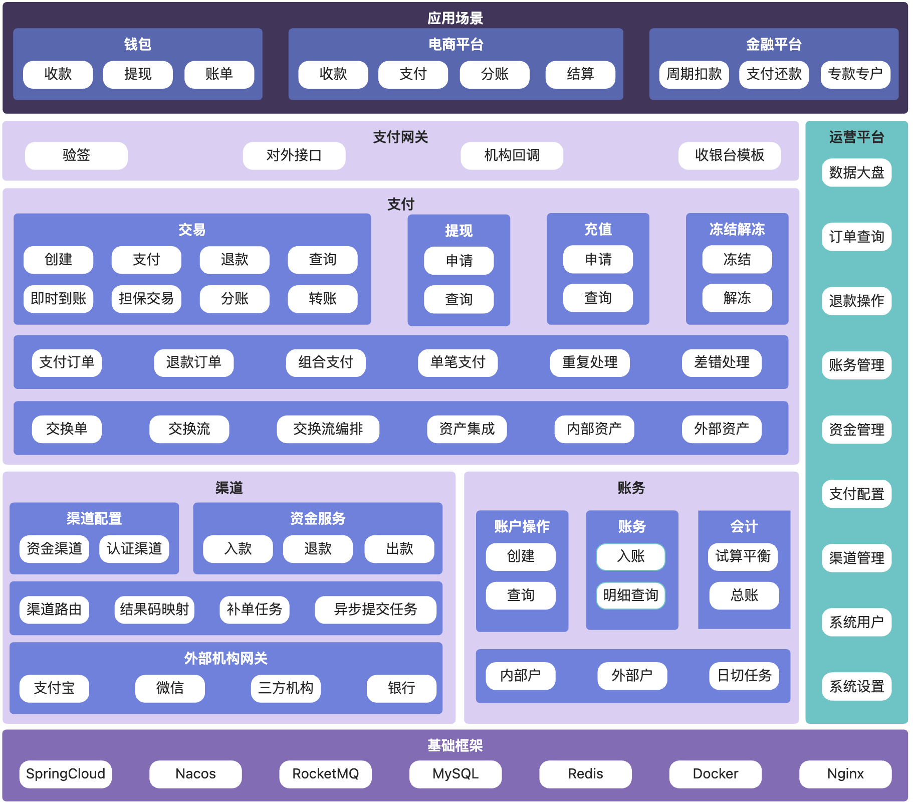

# AnyPlusPay - 高性能支付系统解决方案

## 项目简介

AnyPlusPay 是一套基于领域驱动设计（DDD）理念，采用微服务架构构建的高性能、高可用、易扩展的支付系统解决方案。本项目旨在为电商平台、产业互联网平台等提供从支付接入、交易处理、资金清算到对账管理的完整支付功能，快速适配各类在线支付需求。

详细介绍请查看 [AnyPlusPay 文档](https://www.yuque.com/fengyu-sfney/anypluspay/uk7hgxghli5llszm)

## 系统架构


### 目录结构

``` java
anypluspay
    ├── app -- 应用服务目录
         ├── pgw -- 支付网关
         ├── admin -- 运营平台
         ├── payment -- 支付服务
         ├── account -- 账务服务
         ├── channel -- 渠道服务
         ├── channel-gateway -- 渠道网关目录
                ├── channel-gateway-app -- 渠道网关公共包
                ├── alipay-gateway -- 支付宝网关
                ├── wxpay-gateway -- 微信网关
                └── test-bank-gateway -- 测试银行网关
         └── test-bank -- 测试银行服务，用于模拟支付渠道
    
    ├── framework -- 框架目录
            ├── commons -- 公共
                    └── commons-lang -- 通用工具和类型
            ├── component -- 组件
                    ├── component-api -- 组件 API 定义
                    ├── component-core -- 组件核心实现
                    ├── component-sequence -- 序列号
                    └── component-generator -- 代码生成器
            ├── dependencies -- 依赖定义 pom
            ├── dependencies-third -- 第三方依赖定义 pom
            └── parent -- 应用父 POM
    └── docs -- 文档目录
```

## 技术栈

| 软件名称                                                                    | 描述           | 版本         |
|-------------------------------------------------------------------------|--------------|------------|
| JDK                                                                     | Java 环境      | 17         |
| [Spring Boot](https://github.com/spring-projects/spring-boot)           | 开发框架         | 3.4.1      |
| [Spring Cloud](https://spring.io/projects/spring-cloud)                 | 微服务框架        | 2024.0.0   |
| MySQL                                                                   | 数据库          | 8+         |
| [RocketMQ](https://github.com/apache/rocketmq)                  | 消息           | 5.0        |
| [Nacos](https://github.com/alibaba/nacos)                               | 注册中心、配置中心    | 2.4.1      |
| [MyBatis-Plus](https://mp.baomidou.com/)                                | MyBatis 增强工具 | 3.5.4.1    |
| [MapStruct](https://mapstruct.org/)                                     | 对象转换         | 1.6.3      |
| [Hutool](https://www.hutool.cn/)                                        | Java 工具类库    | 5.8.24     |

---


## 附录

### 关于支付

- 可关注以下公众号获取更多支付相关知识：
    - 凤凰牌老熊
    - 隐墨星辰
    - 刚哥白话
    - 陈天宇宙

### 关于 DDD

- [殷浩详解 DDD 系列](https://developer.aliyun.com/article/715802)
- [COLA 框架](https://github.com/alibaba/COLA)
- [COLA 4.0：应用架构的最佳实践](https://blog.csdn.net/significantfrank/article/details/110934799)

