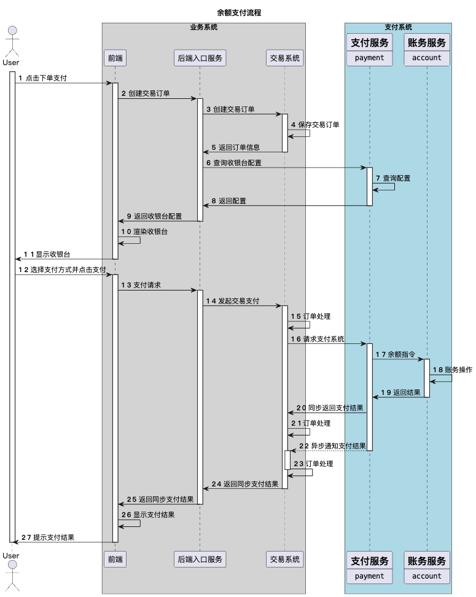
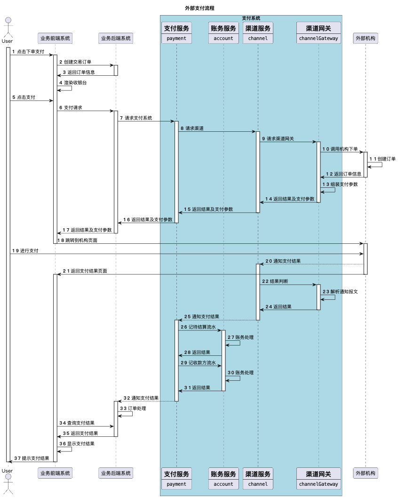
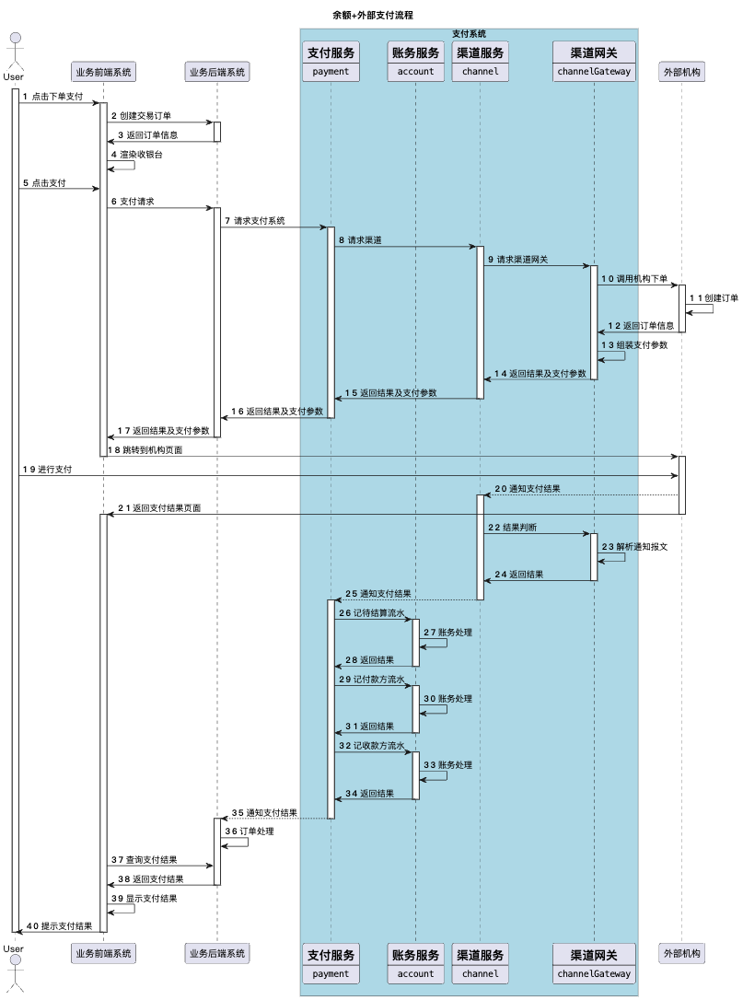
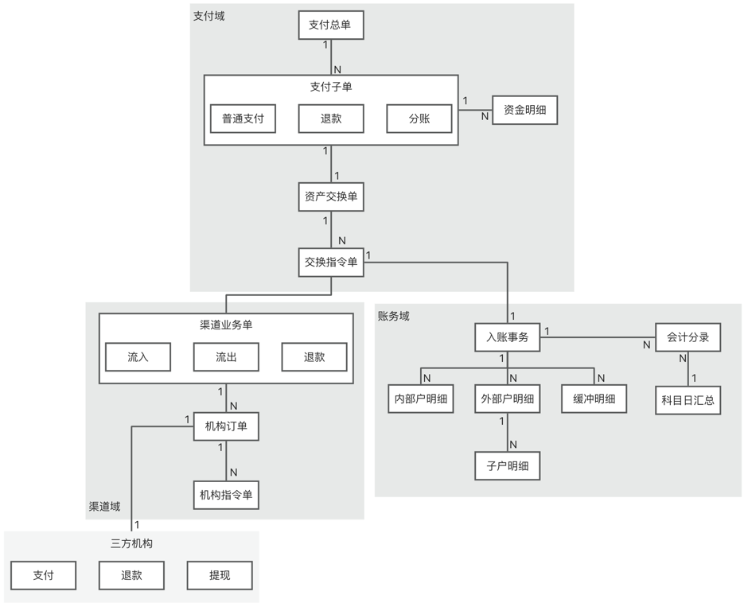
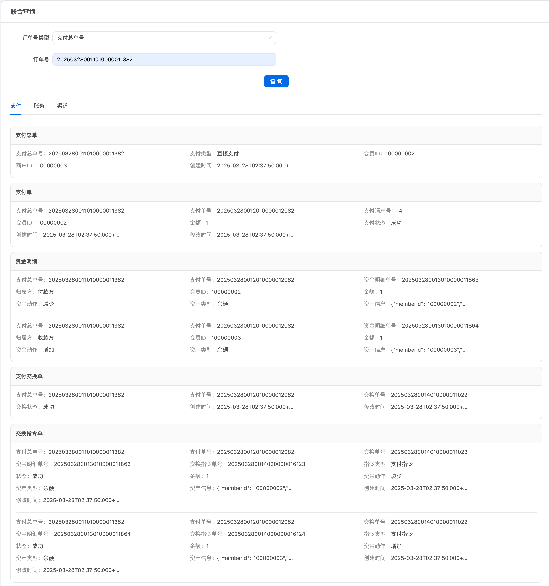
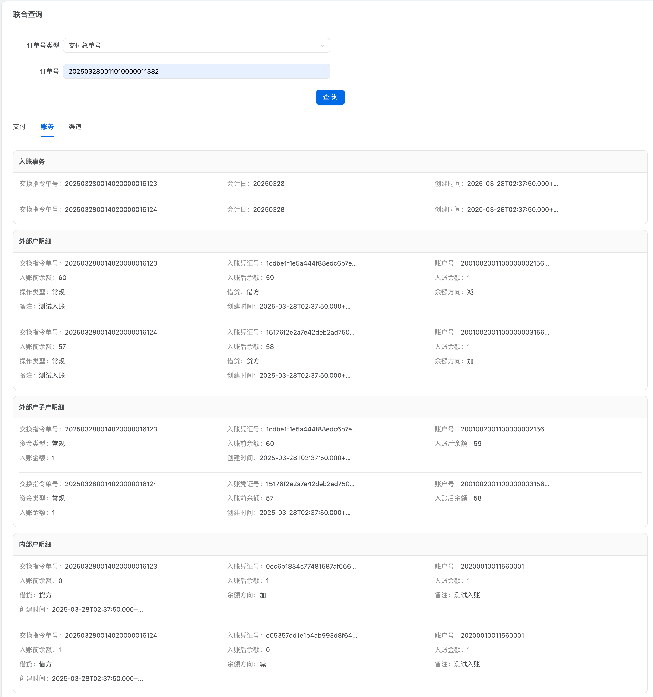
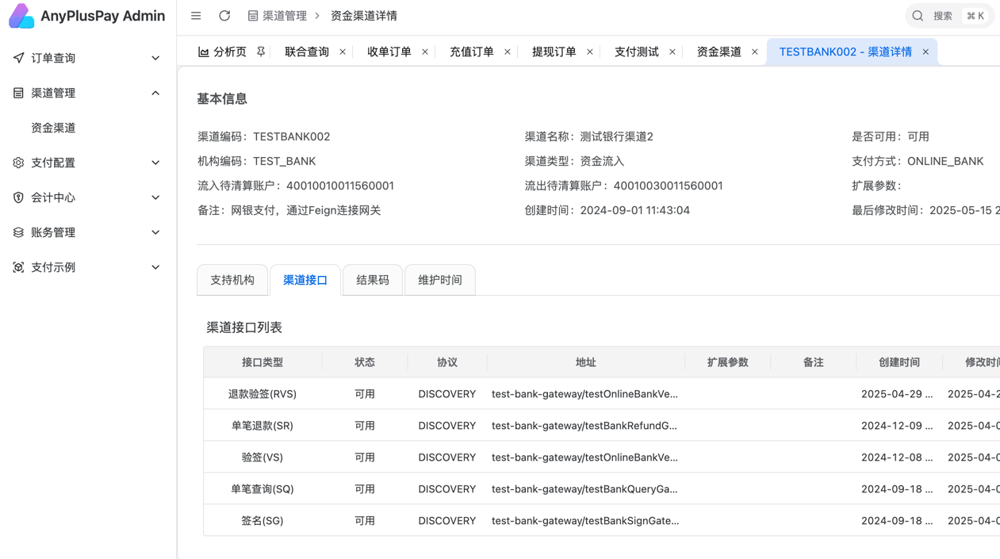

# AnyPlusPay - 高性能支付系统解决方案

## 项目简介

AnyPlusPay 是一套基于领域驱动设计（DDD）理念，采用微服务架构构建的高性能、高可用、易扩展的支付系统解决方案。本项目旨在为电商平台、产业互联网平台等提供从支付接入、交易处理、资金清算到对账管理的完整支付功能，快速适配各类在线支付需求。

### 核心优势

- **领域驱动设计（DDD）**：通过 DDD 进行领域建模，将复杂的支付业务划分为清晰的限界上下文，确保系统架构清晰、代码可维护性强，并能迅速响应业务变化。
- **微服务架构**：使用 Spring Cloud 等主流微服务框架，各子系统独立部署、松耦合，满足高并发和高可用性要求。
- **高性能与高可用性**：集成分布式缓存、消息队列、数据库分库分表等技术，保障系统的稳定性和性能。
- **灵活可扩展**：提供丰富的 API 接口和插件机制，便于与第三方系统对接，支持按需扩展功能。


## 核心功能模块

### 1. 支付服务
- 处理支付的接入，并集成外部渠道、账务、营销等资产端。
- 支持多种支付方式（如余额支付、外部支付、混合支付）。

### 2. 账务服务
- 负责账户管理、资金流水记录及对账等功能。
- 确保资金安全准确。

### 3. 渠道服务及渠道网关
- 实现与第三方支付渠道的对接，发送和接收支付指令。
- 根据不同场景，提供渠道路由功能。
- 包括支付宝网关、微信网关、测试银行网关等。

### 4. 运营平台
- 提供订单查询、数据分析、报表统计等功能。
- 支付方式、渠道等配置管理。


## 适用场景

- **电商平台**：提升用户支付体验，保障交易的安全与便捷。
- **产业互联网平台**：根据行业特性定制支付解决方案，满足多样化支付需求。
- **其他在线支付场景**：如在线教育、旅游出行、生活服务等。


## 系统架构

### 1. 目录结构

``` java
anypluspay
    ├── app -- 应用服务目录
         ├── admin -- 运营平台
         ├── payment -- 支付服务
         ├── account -- 账务服务
         ├── channel -- 渠道服务
         ├── channel-gateway -- 渠道网关目录
                ├── alipay-gateway -- 支付宝网关
                ├── wxpay-gateway -- 微信网关
                └── test-bank-gateway -- 测试银行网关
         ├── test-bank -- 测试银行服务，用于模拟支付渠道
         └── test-trade -- 测试交易服务，用于模拟支付交易侧
    
    ├── framework -- 框架目录
            ├── commons -- 公共
                    └── commons-lang -- 通用工具和类型
            ├── component -- 组件
                    ├── component-api -- 组件 API 定义
                    ├── component-core -- 组件核心实现
                    ├── component-sequence -- 序列号
                    └── component-generator -- 代码生成器
            ├── dependencies -- 依赖定义 pom
            ├── dependencies-third -- 第三方依赖定义 pom
            └── parent -- 应用父 POM
    └── docs -- 文档目录
```

### 2. 核心流程

#### 余额支付


#### 外部支付


#### 余额+外部支付


### 3. 领域模型

#### 单据模型



## 技术栈

| 软件名称 | 描述 | 版本 |
| --- | --- | --- |
| JDK | Java 环境 | 17 |
| [Spring Boot](https://github.com/spring-projects/spring-boot) | 开发框架 | 3.4.1 |
| [Spring Cloud](https://spring.io/projects/spring-cloud) | 微服务框架 | 2024.0.0 |
| MySQL | 数据库 | 8+ |
| Redis | 缓存 | 最新版本 |
| [spring-cloud-alibaba](https://github.com/alibaba/spring-cloud-alibaba) | Nacos 依赖 | 2023.0.3.2 |
| [Nacos](https://github.com/alibaba/nacos) | 注册中心、配置中心 | 2.4.1 |
| [MyBatis-Plus](https://mp.baomidou.com/) | MyBatis 增强工具 | 3.5.4.1 |
| [MapStruct](https://mapstruct.org/) | 对象转换 | 1.6.3 |
| [Hutool](https://www.hutool.cn/) | Java 工具类库 | 5.8.24 |

---

## 后台管理功能
### 查询
#### 联合查询



### 渠道管理

#### 渠道详情
  

## 测试指南

### 单元测试

- `payment`、`account`、`channel` 三个服务下都有单元测试。
- 使用 `JUnit` 和 `Mockito` 进行测试。
- 测试代码位于所有服务的 `app/bootstrap/test` 下，依赖数据库和 Nacos 配置。

### 集成测试

#### 必要服务
1. 必须启动的服务包括：
    - `admin`
    - `payment`
    - `account`
    - `channel`
    - `test-trade`

2. 如果需要测试渠道对应的网关，还需启动 `test-bank`。

#### 测试步骤
1. 输入 `admin` 的地址，如 `http://localhost:8080/`。
2. 在左侧菜单中展开 `支付测试`，点击相应的二级菜单进行测试。
3. 对于产生的测试交易，可在菜单 `支付测试` 下的 `交易查询` 功能中查询。


## 附录

### 关于支付

- 可关注以下公众号获取更多支付相关知识：
    - 凤凰牌老熊
    - 隐墨星辰
    - 刚哥白话
    - 陈天宇宙

### 关于 DDD

- [殷浩详解 DDD 系列](https://developer.aliyun.com/article/715802)
- [COLA 框架](https://github.com/alibaba/COLA)
- [COLA 4.0：应用架构的最佳实践](https://blog.csdn.net/significantfrank/article/details/110934799)

